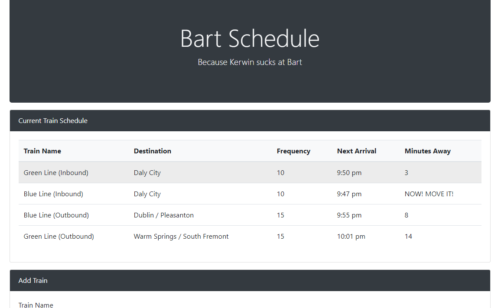

# Train Scheduler

## Summary
A site that reads from and stores information in a database. It utilizes Firebase for storage. User can fill the input forms with train information and it'll display the current train schedule based on current time. Times are converted/formatted using moment.js

### **Highlights:**
- Firebase Data Storage/Retrieval
- Moment.js for time magic
- Recursive function


## Technologies Used
- HTML
- Bootstrap
- Javascript/jQuery
- Firebase
- Moment.js
- Git
- GitHub
- VSCode

## Goals
- Active refresh rate

## Learning Experience
- Learned how to use Firebase
- Learned how to use Moment.js

## Site Picture


## Code Snippet
I chose these lines of code because they highlight the most recent things I've learned

```
// get the next train time based off start time, frequency, and current time
function getNextTrain(startTime, frequency, currentTime) {
    var nextTrainTime = startTime + frequency;
    if (nextTrainTime > currentTime) {
        // return next train time and stop function recursion
        return nextTrainTime;
    }
    // if next train time is now
    else if (nextTrainTime === currentTime) {
        // return next train time and stop function recursion
        return nextTrainTime;
    }

    // recursive function to avoid using a for loop
    return getNextTrain(nextTrainTime, frequency, currentTime);
}

// function to submit new train info to database
function submitTrain() {
        [omitted code]

        // store values into database
        db.ref().push({
            trainName: trainName,
            trainDestination: trainDestination,
            firstTrainTime: firstTrainTime,
            trainFrequency: trainFrequency
        });
        
        [omitted code]
}

// event listener to check database for changes
db.ref().on("child_added", function(snapshot) {
    // store database values into variables
    var trainName = snapshot.val().trainName,
        trainDestination = snapshot.val().trainDestination,
        firstTrainTime = moment(snapshot.val().firstTrainTime, "HH:mm").format("HH:mm"),
        trainFrequency = parseInt(snapshot.val().trainFrequency);

        [omitted code]
```

## Links
Live Page: https://seiretsym.github.io/train_scheduler<br>
Repo: https://github.com/seiretsym/train_scheduler<br>
LinkedIn: https://www.linkedin.com/in/kerwinhy/<br>
GitHub: https://github.com/seiretsym<br>